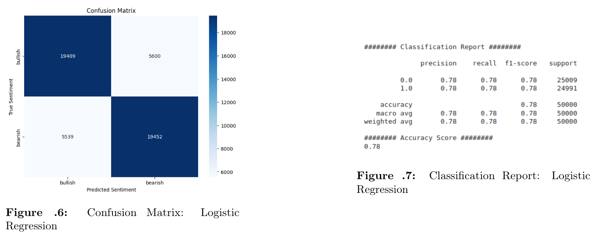
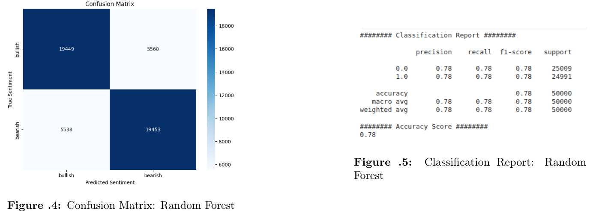
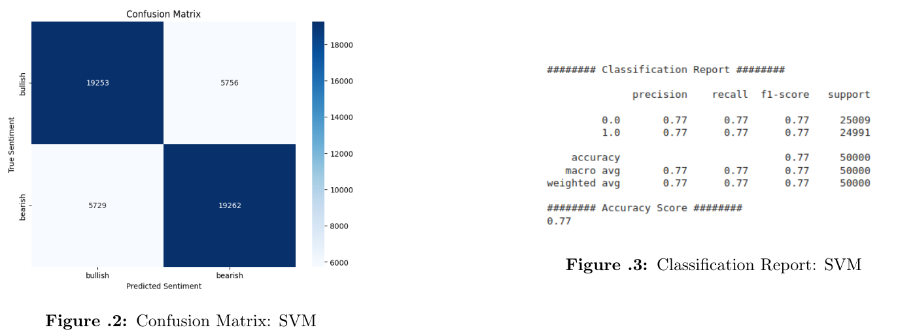
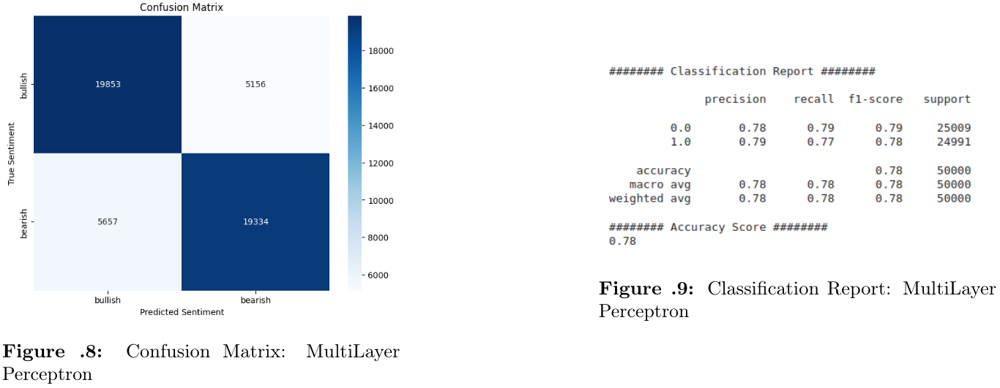
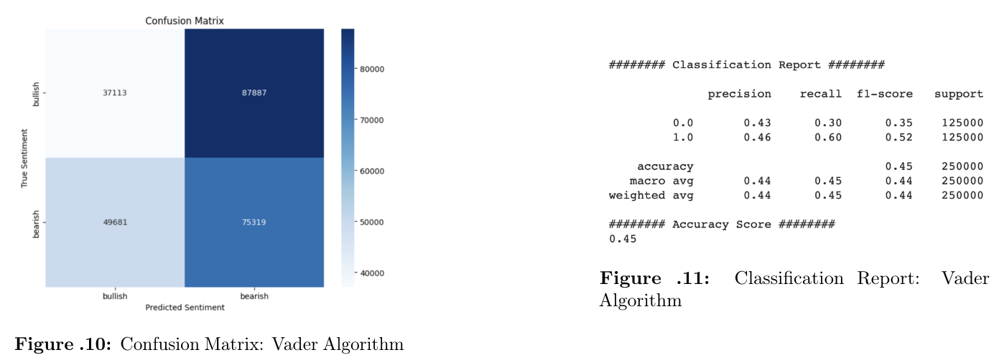
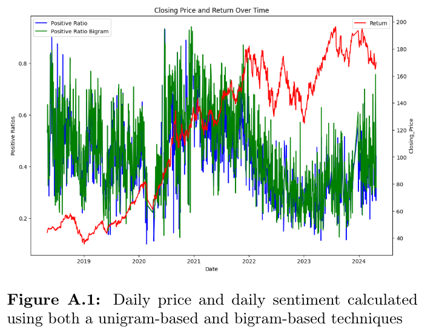
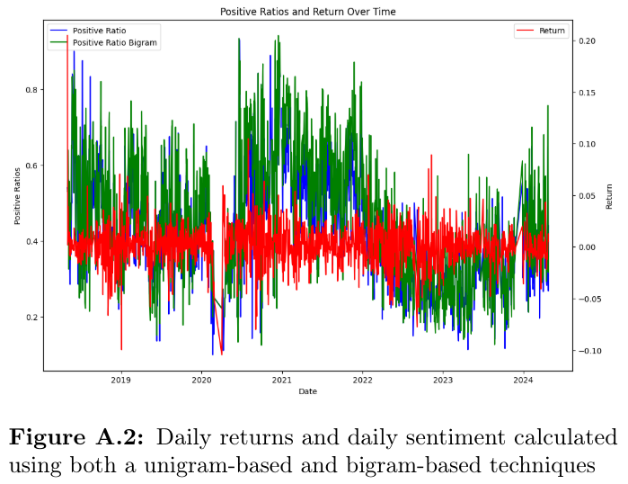

# Stock_Twits_Sentiment_Analysis

Through this research, we seek to bridge the gap between sentiment analysis and investment decision-making, emphasizing the pivotal role sentiments play in market perceptions and behaviors. By exploring various methodologies in terms of preprocessing and employing different machine learning model, the study aims to provide investors with better tools to distill insights from financial tweets.

## Impact of size dataset

**Panel A: Balanced Dataset**

| Dataset Size | Accuracy (%) | MCC       |
|--------------|--------------|-----------|
| 500          | 0.556000     | 0.113326  |
| 1000         | 0.599000     | 0.197996  |
| 2500         | 0.614400     | 0.229231  |
| 5000         | 0.632800     | 0.265649  |
| 10000        | 0.650000     | 0.300162  |
| 25000        | 0.685480     | 0.371189  |
| 50000        | 0.702760     | 0.406013  |
| 100000       | 0.710000     | 0.420605  |
| 250000       | 0.721776     | 0.444175  |
| 500000       | 0.729682     | 0.460252  |
| 1000000      | 0.736317     | 0.473638  |

**Panel B: Unbalanced Dataset**

| Dataset Size | Accuracy (%) | MCC       |
|--------------|--------------|-----------|
| 500          | 0.782000     | 0.003534  |
| 1000         | 0.800000     | 0.009626  |
| 2500         | 0.807600     | 0.066034  |
| 5000         | 0.791600     | 0.124845  |
| 10000        | 0.797800     | 0.190525  |
| 25000        | 0.798640     | 0.231514  |
| 50000        | 0.799720     | 0.269425  |
| 100000       | 0.807190     | 0.317422  |
| 250000       | 0.814072     | 0.355603  |
| 500000       | 0.819240     | 0.378025  |
| 1000000      | 0.824828     | 0.395147  |

## Impact of N-grams on Classification Accuracy

| N-grams                                  | Accuracy (%) | MCC       |
|------------------------------------------|--------------|-----------|
| Unigrams                                 | 72.1128      | 0.443133  |
| Unigrams + Bigrams                       | 74.9872      | 0.501025  |
| Unigrams + Bigrams + Trigrams            | 75.0364      | 0.502947  |
| Unigrams + Bigrams + Trigrams + 4-gram   | 74.7816      | 0.499229  |

## Impact of pre-processing

| Pre-processing Method     | Accuracy (%) | MCC       |
|---------------------------|--------------|-----------|
| Benchmark                 | 76.7256      | 0.535504  |
| Punctuation               | 77.0060      | 0.541255  |
| Stemmer                   | 62.4724      | 0.261860  |
| Emojis                    | 77.2316      | 0.545332  |
| StopWords                 | 74.8520      | 0.498224  |
| Emojis + Punctuation      | 77.3428      | 0.547655  |
| PosTagging                | 76.6048      | 0.534285  |
| Tweet Tokenizer           | 78.1828      | 0.564614  |
| DicoSlang                 | 72.19        | 0.4446    |

Our analysis reveals that while some pre-processing techniques like removing stopwords and stemming may seem intuitive, they can actually degrade classification accuracy, particularly in the context of financial sentiment analysis on tweets. Incorporating emojis and punctuation, on the other hand, proves to be highly beneficial for enhancing model precision, emphasizing the importance of considering diverse pre-processing strategies in text analysis tasks. Overall we would advice for choosing preprocessing methods that are tailored to the problem at hand whenever available or feasible, as can be seen from increase and decrease in performance accuracy when using standardize methods (PorterStemmer, StopWords...) versus specific ones (Punctuation, Emojis, TweetTokenizer).

## Comparison of Machine Learning Algorithms

| Algorithm                | Accuracy (%) | Time      |
|--------------------------|--------------|-----------|
| Multinomial Naive Bayes  | 78.38        | 2 s       |
| Logistic Regression      | 77.7         | 6 s       |
| Support Vector Machine   | 77.03        | 25 s (no parallelization) |
| Random Forest            | 77.8         | 22 s      |
| Multilayer Perceptron    | 78.37        | 2m 40 s   |
| VADER                    | 45           | 15 s      |

### Logistic Regression

### Random Forest

### Support Vector Machine

### Multi Layers Perceptron

### VADER

## Correlations

|                    | Positive_ratio_bigram | Positive Ratio Unigram | Return | Closing Price |
|--------------------|-----------------------|------------------------|--------|---------------|
| Positive_ratio_bigram | 1.000000 | 0.836012 | **0.387585** | 0.351200 |
| Positive Ratio Unigram | 0.836012 | 1.000000 | **0.344269** | 0.387706 |
| Return             | **0.387585**         | **0.344269**           | 1.000000 | 0.145902 |
| Closing Price      | 0.351200              | 0.387706               | 0.145902 | 1.000000 |

## Regressions

### Comparison of OLS Regression Results for Unigram and Bigram Methods

$`
\text{Sentiment}(t) = \beta_0 + \beta_1 \text{Sentiment}(t-1) + \beta_2 \text{Return}(t-1) + \epsilon
`$

| Statistic           | Unigram    | Bigram     |
|---------------------|------------|------------|
| Dep. Variable       | Postive_ratio | Postive_ratio_bigram |
| R-squared           | 0.361      | 0.409      |
| Adj. R-squared      | 0.360      | 0.408      |
| F-statistic         | 338.3      | 424.7      |
| Prob (F-statistic)  | 1.89e-120  | 1.09e-144  |
| Log-Likelihood      | 1048.4     | 909.52     |
| AIC                 | -2091      | -1813      |
| BIC                 | -2075      | -1797      |
| Coefficient: Const  | 0.1655     | 0.1561     |
| Std Err: Const      | 0.010      | 0.011      |
| P>\|z\|: Const        | 0.000      | 0.000      |
| Coefficient: Lag1   | 0.6126     | 0.6622     |
| Std Err: Lag1       | 0.024      | 0.023      |
| P>\|z\|: Lag1         | 0.000      | 0.000      |
| Coefficient: Return_Lag1 | -0.4771 | -0.8681 |
| Std Err::Return_Lag1 | 0.155     | 0.179      |
| P>\|z\|: Return_Lag1  | 0.002      | 0.000      |

### Comparison of OLS Regression Results for Forecasting Returns using Unigram and Bigram Techniques

$`
\text{Return}(t) = \beta_0 + \beta_1 \text{Sentiment}(t-1) + \beta_2 \text{Return}(t-1) + \epsilon
`$

| Statistic           | Unigram    | Bigram     |
|---------------------|------------|------------|
| Dep. Variable       | Return     | Return     |
| R-squared           | 0.000      | 0.000      |
| Adj. R-squared      | -0.001     | -0.001     |
| F-statistic         | 0.1490     | 0.1790     |
| Prob (F-statistic)  | 0.862      | 0.836      |
| Log-Likelihood      | 3561.7     | 3561.8     |
| AIC                 | -7117      | -7118      |
| BIC                 | -7102      | -7102      |
| Coefficient: Const  | 0.0011     | 0.0014     |
| Std Err: Const      | 0.002      | 0.002      |
| P>\|z\|: Const        | 0.513      | 0.369      |
| Coefficient Positive Ratio: Lag1 | -0.0002 | -0.0008 |
| Std Err: Positive Ratio Lag1 | 0.004 | 0.003      |
| P>\|z\|: Positive Ratio Lag1 | 0.949 | 0.784      |
| Coefficient: Return Lag1 | -0.0170 | -0.0154 |
| Std Err: Return Lag1 | 0.033      | 0.033      |
| P>\|z\|: Return Lag1   | 0.602      | 0.635      |

## Findings
Sentiment analysis are widely used and goes beyond price movements, providing a holistic view that considers qualitative factors. By analyzing sentiments in financial tweets, investors can identify trends, catalysts, and anomalies, empowering them to make informed decisions.

In this paper, we offer guidance for finance researchers on deriving sentiment indicators from social media text. We prioritize dataset size over pre-processing and algorithm choice. Utilizing pre-labeled data from platforms like StockTwits can provide researchers with large datasets, avoiding manual annotation. We show the importance of text pre-processing, particularly the positive impact of including emojis and punctuation. Unlike traditional media articles, social media messages require tailored pre-processing methods. We show that complex algorithms may not enhance accuracy, advocating for simpler models like Naive Bayes and Logistic Regression. Despite the belief in sophisticated models, simplicity often suffices for sentiment analysis. In exploring sentiment's link with stock returns, we find no empirical evidence for its predictive power on large-cap stocks at a daily frequency. Previous literature relying on smaller datasets and machine learning methods may need reassessment in light of our findings.

## References

Thomas Renault. Sentiment analysis and machine learning in finance: a comparison of methods and models on one million messages. Digital Finance, 2020, 2 (1-2), pp.1-13. ⟨10.1007/s42521-019-00014-x⟩. ⟨hal-03205149⟩

